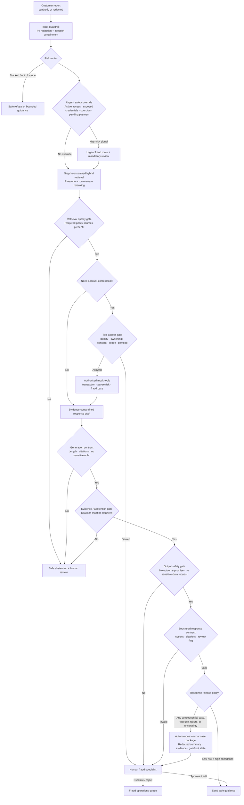
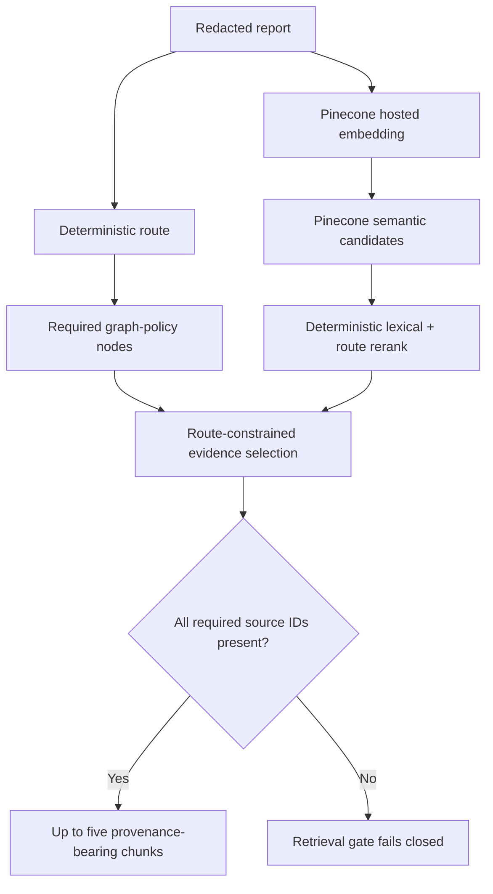
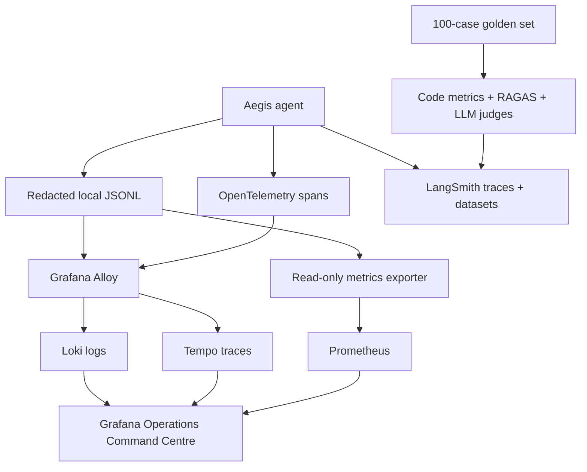

# Aegis Fraud Triage — Architecture

## Purpose

Aegis is an evidence-first Australian banking scam-triage copilot. It gives safe guidance and prepares a reviewable triage draft; it does **not** move money, block accounts, decide liability, or guarantee recovery.

## Core decision flow

## Retrieval design

The router supplies the required core nodes. Pinecone retrieves semantic candidates, but missing graph-required evidence fails closed, preventing tools and forcing abstention/HITL.

## Telemetry and evaluation flow

## Control boundaries

| Boundary | Allowed | Deliberately prohibited |
| --- | --- | --- |
| Input | Redacted report and server-issued customer reference | Credentials, raw PII, system-prompt disclosure |
| Retrieval | Approved policy/public-safety chunks with provenance | Treating public content as bank policy |
| Tools | Narrow mock read/enrichment tools after authorisation | Payment movement, account changes, cross-customer lookup |
| Generation | Draft from redacted approved evidence | Invented policy, refund guarantee, sensitive-data collection |
| Release | Narrow low-risk guidance may auto-send; internal case package can be prepared | Autonomous consequential banking guidance |

## Implementation map

| Component | Implementation |
| --- | --- |
| Router, gates, trajectory | `src/aegis_fraud_triage/agent.py` |
| Tool boundary | `tool_authorisation.py` |
| HITL release policy | `hitl.py` |
| Pinecone retrieval | `pinecone_policy.py` |
| Nebius drafting | `nebius_generation.py` |
| Evaluation and judge pack | `evaluation.py`, `run_provider_evals.py`, `run_automated_judge_validation.py` |
| Telemetry and alerts | `observability.py`, `monitoring.py`, `metrics_exporter.py` |
| Local operations stack | `docker-compose.observability.yml`, `observability/` |

## Deployment posture

The Docker stack is production-shaped, not production-hosted. A real deployment still needs private networking, TLS/mTLS, managed persistence/backups, SSO/RBAC, real identity/entitlements, key rotation, retention controls, approved policy governance, security review and compliance approval.
