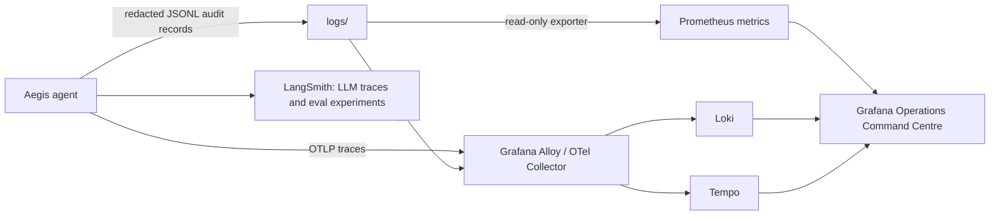

# Aegis Operations Command Centre

The MVP uses a local, production-shaped monitoring stack:



## Why this stack

- **Grafana** is the executive/demo view: safety posture, SLOs, human-review load, cost, routing mix and golden-set quality.
- **Prometheus** stores compact operational metrics, not raw customer text.
- **Grafana Alloy** is the supported OpenTelemetry Collector distribution: it accepts OTLP traces, applies memory limits and batching, and tails the redacted JSONL audit stream. Promtail is deliberately not used because it is end-of-life.
- **Loki** holds the existing redacted JSONL audit stream for trace-ID-led investigation.
- **Tempo** stores OpenTelemetry spans for a vendor-neutral trajectory view.
- **LangSmith** remains the LLM-specialist system: prompts, nested model/tool traces, datasets and offline experiments.

## Dashboard contents

The provisioned dashboard is **Aegis Fraud Triage | Operations Command Centre**. It includes:

1. Interactive traces, escalation rate, P95 latency, pending human reviews, high/critical alerts and cost/run.
2. Scenario-routing and risk distribution.
3. Safety-alert, latency-SLO and gate-failure trends.
4. Golden-set quality scorecard: routing, escalation, citation, guardrail and critical-case recall.
5. A redacted, searchable audit-log stream; use its trace ID to investigate in Tempo and LangSmith.

## Start locally

Docker Desktop is required for Grafana, Prometheus, Loki, Tempo and Alloy. The project is already configured; install and start Docker Desktop before running these commands.

Before starting the stack, add these local-only credentials to `.env` (do not commit the file):

```env
GRAFANA_ADMIN_USER=aegis-admin
GRAFANA_ADMIN_PASSWORD=<a-unique-long-local-password>
```

In terminal 1, from the project root:

```bash
source .venv/bin/activate
PYTHONPATH=src python -m aegis_fraud_triage.metrics_exporter --trace-dir logs --port 8001
```

In terminal 2:

```bash
docker compose -f docker-compose.observability.yml up -d
```

Then add this local-only line to `.env` and restart the agent/Streamlit app:

```env
OTEL_EXPORTER_OTLP_ENDPOINT=http://localhost:4318/v1/traces
```

Open:

- Grafana: `http://localhost:3000` — use the local credentials you set in `.env`.
- Prometheus: `http://localhost:9090`
- Alloy collector health/UI: `http://localhost:12345`
- Streamlit agent/HITL console: `http://localhost:8501`

To stop the stack without deleting its local volumes:

```bash
docker compose -f docker-compose.observability.yml down
```

## Privacy and operational boundaries

- This stack is for local demonstration only; it should never receive unredacted customer records, passwords, codes, full account numbers or API keys.
- Metrics are aggregated from the existing local redacted audit trail. The exporter is read-only and binds to `127.0.0.1`.
- Keep LangSmith traces redacted and use the APAC endpoint configured in `.env`.
- Prometheus alert rules enforce the gate-failure, safe-abstention, latency and cost thresholds. They are deliberately separate from the agent's immediate critical-safety controls.
- Before a hosted deployment, configure private networking, TLS/mTLS, managed storage/backups, enterprise SSO/RBAC, key rotation, retention controls, an Alertmanager/on-call integration and independent security review.
