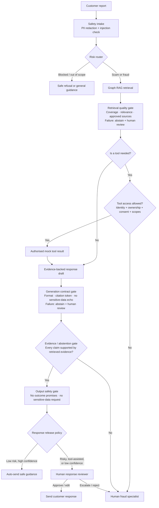

# Aegis Fraud Triage

An evidence-first, safety-constrained MVP for triaging reported scams and authorised-payment fraud in an Australian banking setting. It is a guidance and escalation system, not a decisioning engine: it never moves money, blocks an account, determines liability, or promises recovery.

## Architecture



Every node emits a redacted trace to local JSONL and, when configured, LangSmith and OpenTelemetry. The same trajectory feeds golden-set, RAGAS, and LLM-judge evaluations.

## Version 1 scope

- Router: urgent fraud, authorised payment scam, credential compromise, card security, information, out of scope, and blocked inputs.
- Graph RAG: route-required policy nodes constrain either a local auditable fallback or the active Pinecone semantic retriever. The live namespace contains the versioned demonstration corpus and fails closed if required evidence is absent.
- Tools: safe mock transaction, payee-risk, and fraud-case APIs behind a deny-by-default authorisation gate. No irreversible banking action exists in this MVP.
- Gates: PII redaction, injection containment, server-asserted identity/ownership/consent/scope checks, citation/evidence validation, recovery-promise prevention, and mandatory escalation for urgent risk.
- Autonomy v1.1: a high-recall urgent-risk override, deterministic route-aware reranking, a server-validated response contract, and a complete internal review-case package. These prepare reversible internal work; they do not authorise banking actions.
- Human-in-the-loop release: all financial or account-security guidance, any successful tool result, failed gate, or low-confidence route is held as a redacted review draft. Only narrow general-safety guidance may auto-send; blocked prompt-injection containment stays automated to resist review-queue abuse.
- Observability: redacted local JSONL trajectories, OpenTelemetry through Grafana Alloy to Tempo, Grafana/Prometheus/Loki operations views, and LangSmith-ready metadata.
- Evaluation: a versioned 100-case synthetic golden dataset with expected tool-call contracts, chunk IDs, citations and trajectories; deterministic whole-system metrics, RAGAS, and automated LLM judge validation.

## Data strategy

The core dataset is deliberately synthetic and de-identified. It has 100 distinct cases: 50 representative reports, 30 edge cases, 15 known-failure hypotheses, and 5 adversarial cases. This precisely follows the course’s recommended 50% / 30% / 15% / 5% evaluation mix. Its taxonomy draws on Australian Scamwatch’s public scam categories and reporting guidance; no public dataset is treated as bank policy or imported as customer data.

`data/SOURCES.md` describes a controlled expansion path: use public Scamwatch data for coverage, then a licensed/approved source such as a Hugging Face scam corpus only for language diversity, and finally governed de-identified bank cases for realistic calibration and held-out testing.

The retrieval layer loads 60 provenance-rich public Australian customer-safety chunks from `data/public_safety_corpus_v1.jsonl`, alongside 9 internal control nodes. Regenerate it with `python data/build_public_safety_corpus.py`. Public chunks are short paraphrases with source links and must not be represented as bank policy.

## Run

```bash
python3 -m venv .venv
source .venv/bin/activate
pip install -r requirements.txt
export PYTHONPATH=src
python data/generate_golden_dataset.py
python run_evals.py
pytest -q
```

Run one end-to-end local trajectory:

```bash
PYTHONPATH=src python run_agent.py "I just sent a PayID transfer and now think it was a scam."
```

The command prints the route, chunk-level evidence citations, mock tool calls, gates, response-release status, full trajectory, latency, cost estimate, and a trace ID. Interactive runs append redacted JSONL trace and review-queue events under `logs/`; offline evaluations deliberately do not pollute the review queue.

Run the high-recall urgent-risk regression pack with the full suite:

```bash
PYTHONPATH=src pytest -q
```

The 20-case `data/urgent_override_regression_v1.jsonl` pack includes active remote access, credential/OTP exposure, coercion, pending payment and non-urgent near-miss scenarios.

## Safety and production boundary

Never add API keys, raw customer messages, account numbers, card data, passwords, or one-time codes to this repository, traces, or LangSmith. The local `local_demo_context` is an explicit fixture only; production middleware must construct authorisation context from a verified session and entitlement service. Before production use, replace demo knowledge with approved policy documents; add real service authentication, authorisation, human approval, retention controls, red-team testing, and privacy/compliance review.

For the checked local results, limitations, and exact next steps before connecting providers, read `PROJECT_STATUS.md`.

For the active alert policy, offline evaluation catalog, online monitoring metrics, and beta operating cadence, read `MONITORING_AND_EVALUATION.md`.

## Reference documentation

- `ARCHITECTURE.md` — standalone Mermaid diagrams, boundaries and component map.
- `PROJECT_REFERENCE.md` — goal, success criteria, AI stack, trade-offs, data, evaluation and production boundary.
- `INTERVIEW_GUIDE.md` — senior-level narrative, demo flow and interview answers.
- `INTERVIEW_QA.md` — detailed basic-to-advanced technical, system-design and stakeholder Q&A.
- `AUTONOMY_V11.md` — autonomy increment, controls, metrics, trade-offs and safe expansion plan.
- `OFFLINE_EVALUATION_RUNBOOK.md` — provider evaluation, RAGAS and automated judge-validation commands.
